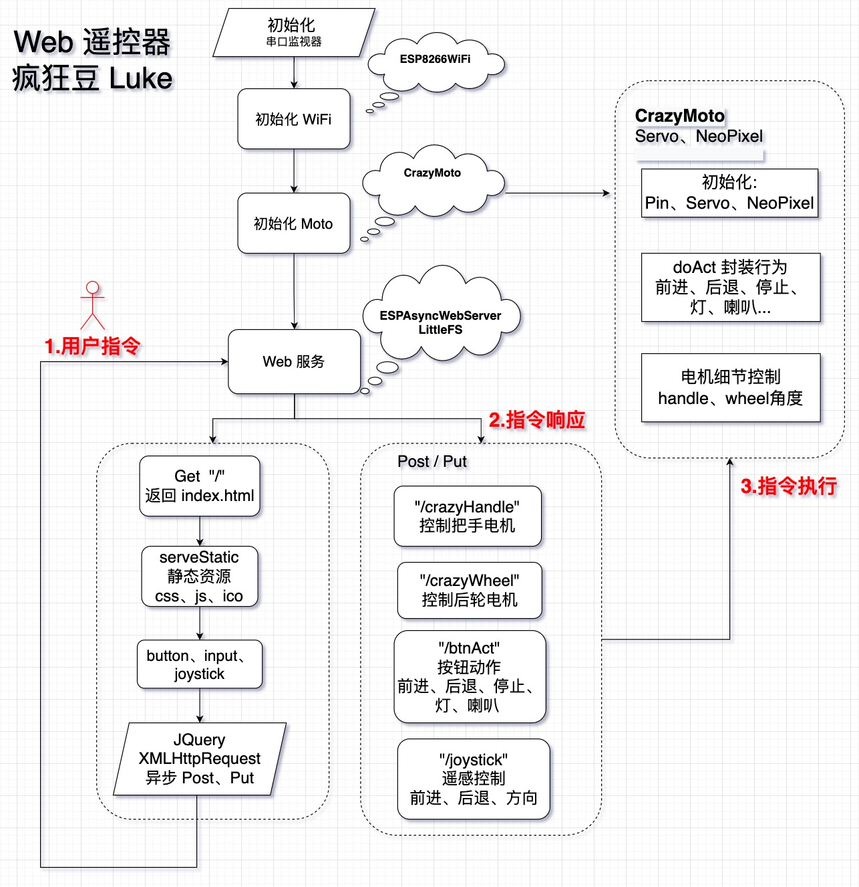

# 网页 Web 遥控器
> WebRemoteController 实现手机浏览器异步控制电路：舵机、灯、喇叭等。

## 视频
* B站： https://www.bilibili.com/video/BV1VT4y1v7KU/


## 开发平台
*  IDE：Visual Studio Code + PlatformIO
*  开发版:  ESP 8266

 （Arduino 也可以使用）

## 目录
```
|--WebRC
|- platformio.ini
|--src
   |- main.cpp		Web 服务
   |- CrazyMoto.cpp	疯狂摩托功能
|--data				Web 页面
   |- index.html		
   |- joystick.html		
   ...

```


## 工程思路



## 界面


## 参考电路


### 参考


*  疯狂摩托硬件制作部分  
 https://github.com/crazy-luke/Crazymoto

*  virtualjoystick.js  
https://github.com/jeromeetienne/virtualjoystick.js


